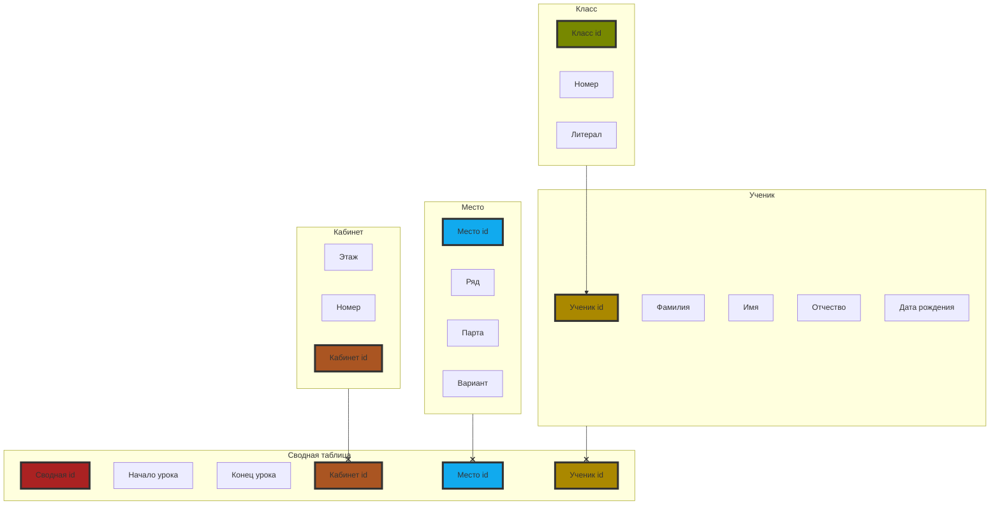

```mermaid
graph TD;

subgraph Кабинет
direction RL
AK[Этаж]
BK[Номер]
СK[Кабинет id]
style СK fill:#a52,stroke:#333,stroke-width:4px
end


subgraph Сводная таблица
direction RL
AC[Сводная id]
BC[Начало урока]
CC[Конец урока]
EC[Кабинет id]
RC[Место id]
FC[Ученик id]
style AC fill:#a22,stroke:#333,stroke-width:4px
style EC fill:#a52,stroke:#333,stroke-width:4px
style FC fill:#a80,stroke:#333,stroke-width:4px
style RC fill:#1ae,stroke:#333,stroke-width:4px

end

subgraph Ученик
direction RL
AY[Ученик id]
BY[Фамилия]
CY[Имя]
DY[Отчество]
RY[Дата рождения]
style AY fill:#a80,stroke:#333,stroke-width:4px
end

subgraph Класс
direction RL
AL[Класс id]
BL[Номер]
CL[Литерал]
style AL fill:#780,stroke:#333,stroke-width:4px
end

subgraph Место
direction RL
AM[Место id]
BM[Ряд]
CM[Парта]
DM[Вариант]
style AM fill:#1ae,stroke:#333,stroke-width:4px
end

Кабинет --x EC
Ученик --x FC
Место --x RC
Класс --> AY
```  